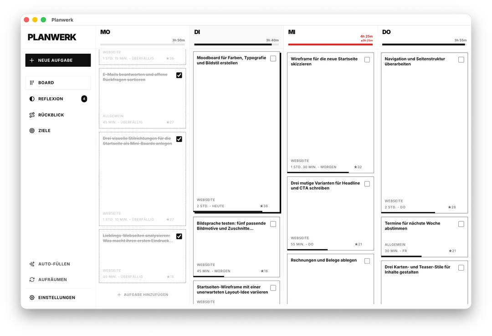
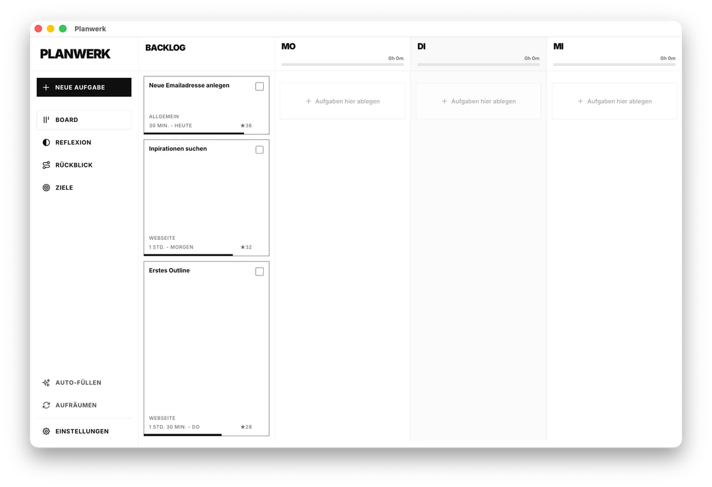
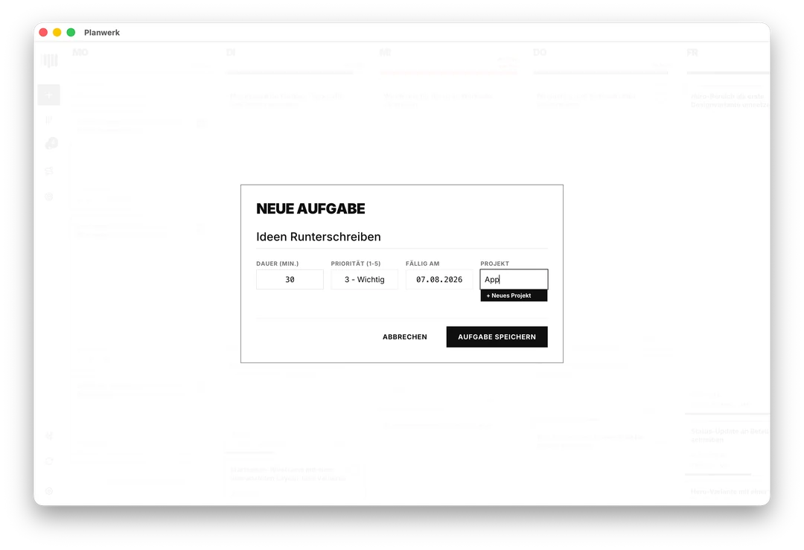
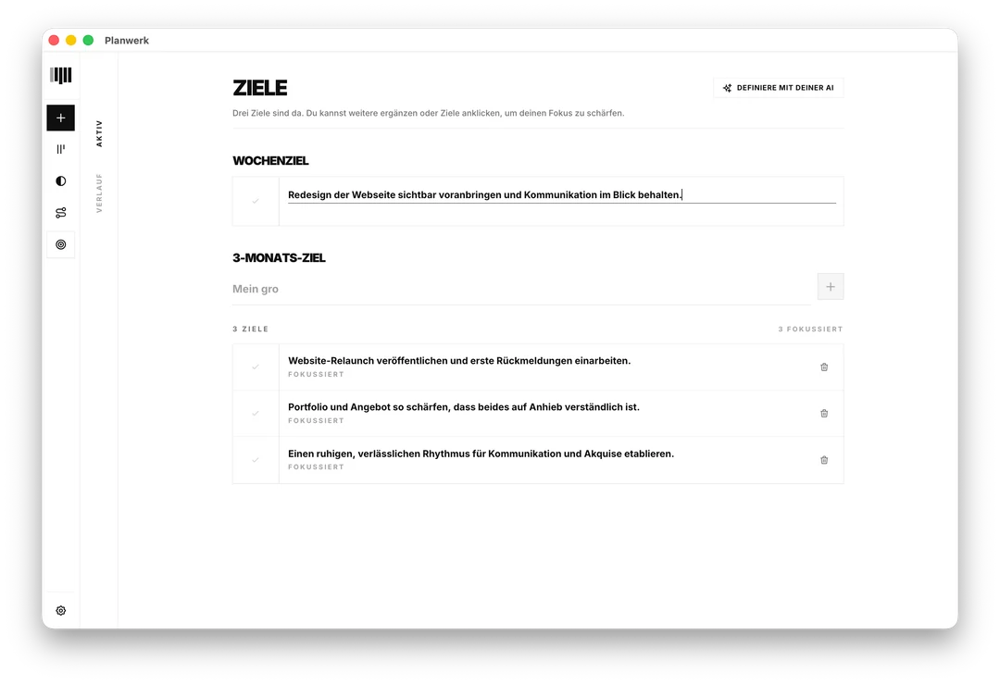
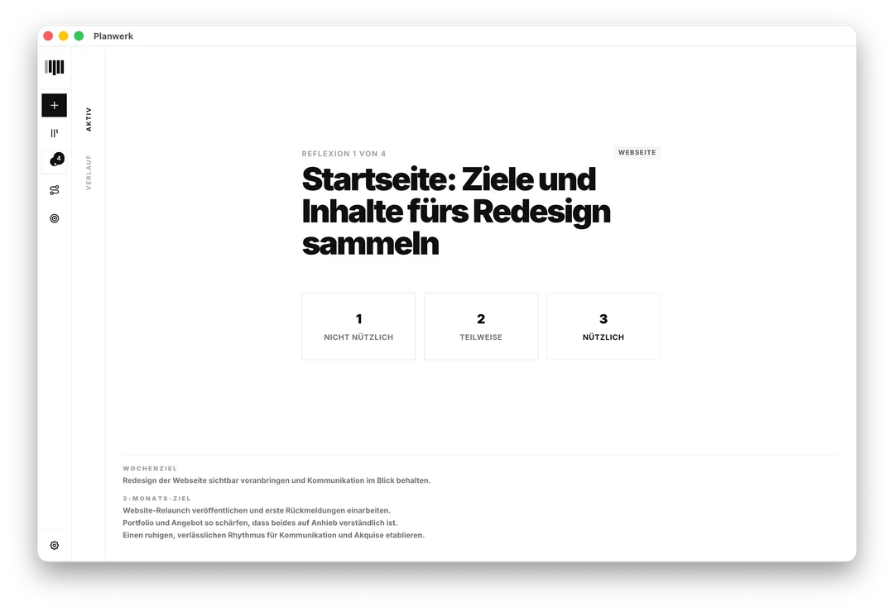
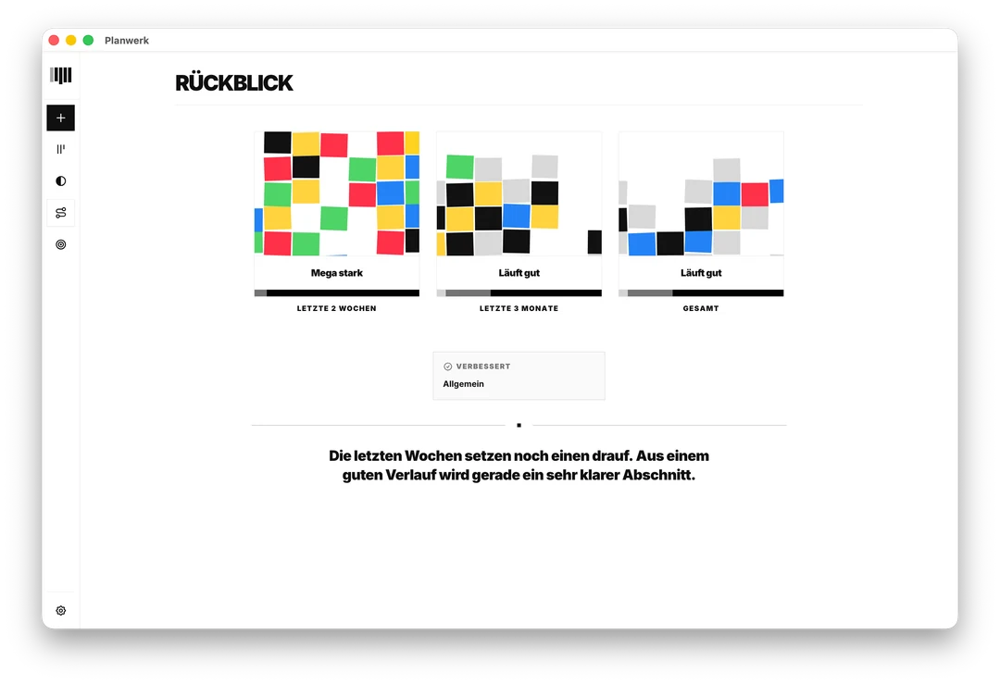

# Planwerk

Planwerk is a local desktop app that helps people move towards their goals with about five minutes of deliberate planning each day. Instead of managing as many tasks as possible or scheduling every minute, Planwerk brings proven ideas from goal setting, time management, and reflection directly into the way it works: plan at a useful level, fill only a realistic share of the available time, make progress visible, and look back regularly. It is made for freelancers, creatives, founders, knowledge workers, students, and anyone who wants orientation without maintaining a complex productivity system.



## Installation

Download the latest version for macOS or Windows from [GitHub Releases](../../releases/latest). No account or Planwerk cloud is required for the core features.

The first release is not code-signed yet, so macOS Gatekeeper or Windows SmartScreen may show a warning. Only download Planwerk from this official repository.

### Set up Planwerk with a coding agent

If you prefer to build Planwerk from source or run into setup problems, paste the prompt below into a local coding agent such as Codex or Claude Code. The agent needs access to your shell and, for the final screenshot, your desktop.

```text
Set up Planwerk on this computer from its official GitHub repository:
[https://github.com/benjifunkt/planwerk.git](https://github.com/benjifunkt/planwerk.git)

First inspect the operating system and the development tools that are already
available. Then:

1. Clone the repository into a new folder. If it already exists, do not
   overwrite it.
2. Read README.md, package.json, and .nvmrc before running setup commands.
3. Install the required Node.js version and the project dependencies.
4. Start the Electron development app and verify that it opens successfully.
5. Run the tests and the TypeScript type check.
6. Create a packaged build for the current operating system without publishing
   a release.
7. Tell me exactly where the generated build files are located.
8. If you have desktop access, take a screenshot of the running app, save it
   next to the project, and tell me its path. If you do not have desktop access,
   say so instead of pretending that the app was opened.

Do not publish a release, modify the source code, bypass operating-system
security warnings, or install anything system-wide without explaining it first.
If a step fails, diagnose the problem and continue when it is safe to do so.
```

## Development

Planwerk uses the Node.js version defined in `.nvmrc`.

```bash
git clone https://github.com/benjifunkt/planwerk.git
cd planwerk
nvm use
npm install
npm run electron:dev
```

Create a packaged build for the current platform with:

```bash
npm run electron:build
```

Useful commands:

| Command | Purpose |
| --- | --- |
| `npm run electron:dev` | Start the Electron app for development |
| `npm run dev` | Start the browser-only Vite dev server |
| `npm run electron:build` | Build the desktop app for the current platform |
| `npm test` | Run the test suite |
| `npm run typecheck` | Check the TypeScript code |
| `npm run release:check` | Run all checks used before a release |

For a Mac running macOS Catalina 10.15, use `.nvmrc.legacy` and `npm run install:legacy`. The legacy setup keeps Electron on a version compatible with older macOS releases.

## What Planwerk helps with

- Collect tasks before deciding when they belong
- Plan the current week with realistic time budgets
- Keep effort, priority, and deadlines visible
- Break large tasks into concrete next steps
- Connect daily work with a weekly focus and three-month goals
- Leave room for unexpected work, rest, and focused attention
- Reflect on past weeks and improve future planning

Planwerk deliberately works with rough time budgets instead of minute-by-minute scheduling. The aim is not to fill every hour, but to develop a realistic sense of what fits into a day or week.

## Product tour

### Weekly board



The board is the central place for the current week. Tasks can be collected in the backlog and then placed on individual days when there is enough capacity for them.

### Tasks



Tasks stay intentionally simple: a title, estimated duration, priority, deadline, and project provide enough context for a realistic decision without making task creation cumbersome.

### Goals



Three-month goals provide a longer-term direction. A weekly goal turns that direction into one concrete focus for the current week.

### Reflection



Reflection helps compare the past week with reality: what worked, what was unrealistic, and what should change next week. It is about learning from the plan, not judging personal performance.

### Lookback



The lookback brings past weeks and reflections together. It makes progress and recurring patterns visible without turning personal planning into a performance dashboard.

## Local-first by design

Planwerk stores a workspace in a local `.planwerk` file. It contains tasks, projects, the current week, goals, reflections, and planning preferences.

The file behaves like a personal document: it can be stored, copied, moved, and backed up wherever its owner chooses. Planwerk does not require an account, a central cloud, or a permanent internet connection for its core features.

## Local MCP integration

Planwerk includes an optional local [Model Context Protocol](https://modelcontextprotocol.io/) server. Compatible coding agents and other MCP clients can use it to read the current planning context and perform explicit planning actions.

Local MCP access is disabled by default. Enable it under **Settings > App & Data > Local MCP Access**. While Planwerk is running, the app shows the local endpoint and a dedicated access token. Clients must support a custom `Authorization: Bearer <access-token>` header.

The server is bound to the IPv4 loopback interface, uses the currently open `.planwerk` file, and is intended only for access on the same device. Do not expose it through port forwarding, a tunnel, a reverse proxy, or another network bridge.

For example, a local Claude Code session can be connected with:

```bash
claude mcp add --transport http planwerk --scope local \
  http://127.0.0.1:3789/mcp \
  --header "Authorization: Bearer <access-token>"
```

Keep the token in local user configuration and never commit it to the repository.

## Principles

- **Five minutes, not system maintenance:** planning should stay quick enough to support the actual work.
- **Realistic, not complete:** free capacity is necessary for the unexpected, recovery, and focus.
- **Make time visible, not controlled:** estimates help prevent overplanning; Planwerk is not a time tracker.
- **Orientation, not invisible automation:** important planning decisions remain with the person using the app.
- **Planning and reflection belong together:** plans improve when they are regularly compared with reality.

## Project status

Planwerk is in active development. Version `1.0.0` is the first public release and provides the foundation for weekly planning, tasks, goals, reflection, lookback, and local integrations.

Feedback, bug reports, ideas, and contributions are welcome through [GitHub Issues](../../issues).

## License

Planwerk is released under the [GNU Affero General Public License v3.0](https://www.gnu.org/licenses/agpl-3.0.html) (`AGPL-3.0-only`). It can be used, studied, modified, and used commercially. Modified versions that are distributed or made available as a network service must make their corresponding source code available under the same license.
